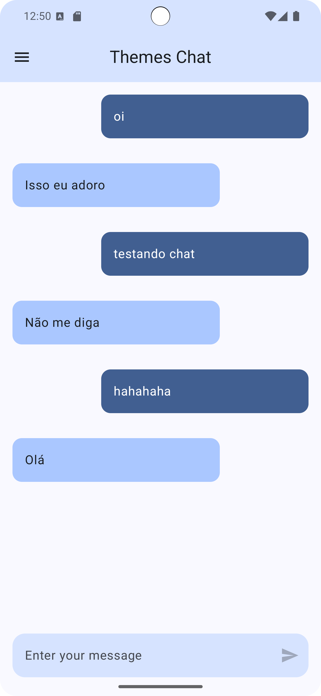
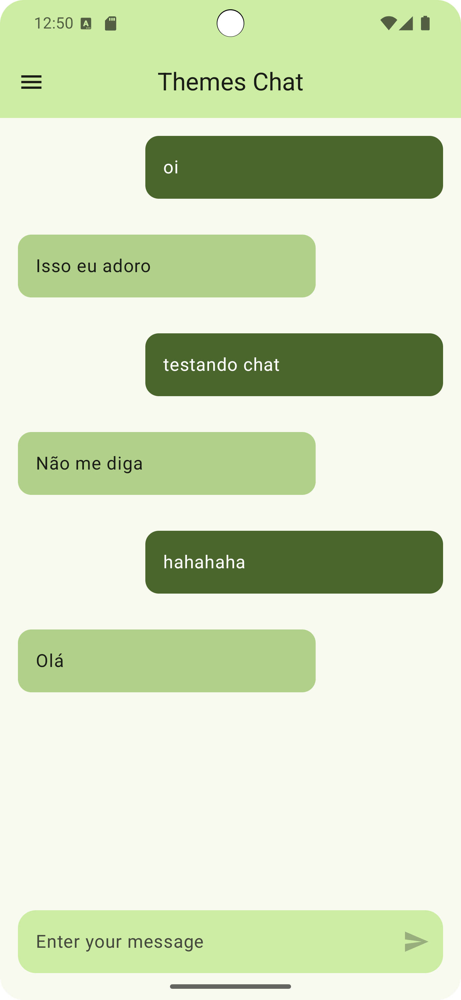
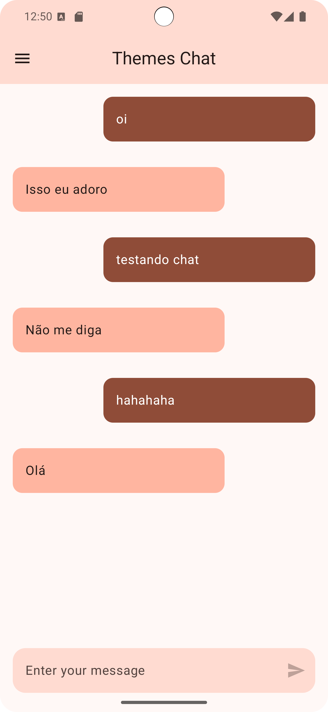
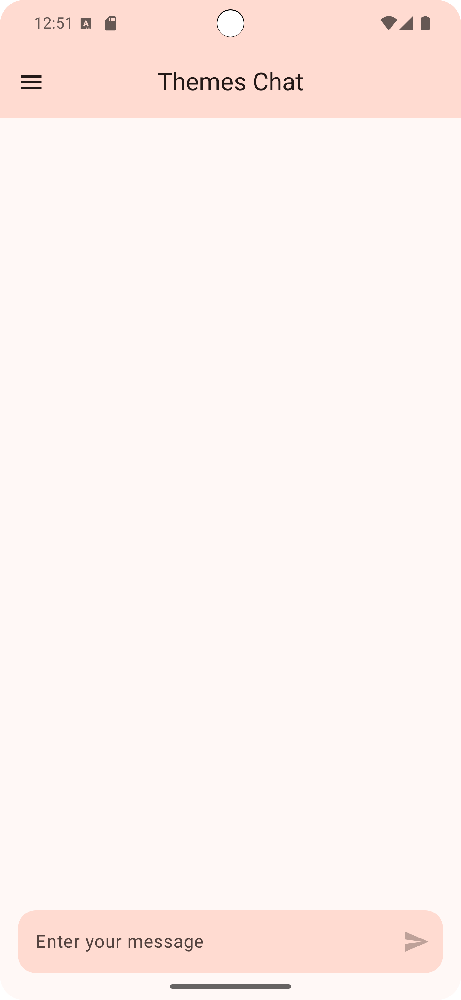

# 🚀 Chat App com Jetpack Compose

## 📖 Resumo do Projeto

Este projeto é uma aplicação de chat simples desenvolvida como parte de um curso para explorar os recursos do Jetpack Compose no Android. O principal objetivo é aprender a integrar componentes de interface, animações e temas dinâmicos. A aplicação permite enviar mensagens que recebem respostas automáticas aleatórias e suporta mudança de temas, incluindo modos claro e escuro personalizados. O foco é entender o processo de desenvolvimento de uma aplicação desde o zero, com implementação progressiva dos conceitos aprendidos.


## 📷 Screenshots

|  |  |  |
|:-------------------------------------------------------------:|:-------------------------------------------------------------------:|:------------------------------------------------------------:|
|  

 


## 💡 Como Rodar o Projeto

1. **Clone o repositório**:
   ```bash
   git clone git@github.com:Elanilson/ThemeChats.git
   ```
2. **Abra o projeto no Android Studio**.
3. **Compile e execute o projeto** em um dispositivo/emulador.

---

## 📜 Licença

Este projeto é para fins educacionais e demonstração de habilidades técnicas. 🚀
